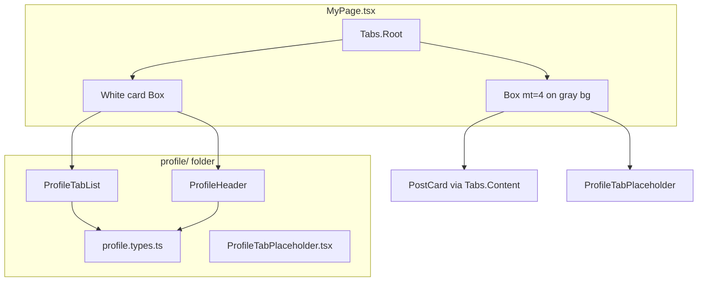

# Profile UI — maintainer guide

This folder holds the Facebook-style profile header and tab bar used on **My Page**. Use this doc to see how the layout is built and where to change things when you fix bugs or add features.

## Quick orientation

| Question | Answer |
|----------|--------|
| Which route? | `src/routes.tsx` → `<MyPage />` |
| Who owns tabs? | **`MyPage.tsx`** owns `Tabs.Root` and all `Tabs.Content` (posts, placeholders) |
| What does `ProfileHeader.tsx` export? | **`ProfileHeader`** (avatar + info + buttons) and **`ProfileTabList`** (tab row only) |
| Shared types / tab ids | **`profile.types.ts`** |

`ProfileTabList` must render **inside** the same `Tabs.Root` as the content panels (in `MyPage.tsx`). Do not wrap it in a second `Tabs.Root`.

---

## How files connect



**Page background:** `#F2F4F7` (gray)  
**Header card:** white, rounded, bordered — only profile + tabs  
**Feed below tabs:** sits on gray with `mt={4}` so post cards stand out

---

## Visual layout

### Desktop (`md` breakpoint and up)

Inside the white card, the profile block is a **horizontal row** (`direction={{ base: "column", md: "row" }}` in `ProfileHeader.tsx` lines 46–51):

```
┌─────────────────────────────────────────────────────────────┐
│  (○) Avatar    Name + friends + details    [Add] [Edit]     │
├─────────────────────────────────────────────────────────────┤
│  All | About | Friends | Photos | Reels | More ▼            │
└─────────────────────────────────────────────────────────────┘
        ↑ gray gap (mt=4 in MyPage.tsx)
┌─────────────────────────────────────────────────────────────┐
│  Post cards (white, rounded) on #F2F4F7                     │
└─────────────────────────────────────────────────────────────┘
```

| Region | Alignment | Key props |
|--------|-----------|-----------|
| Avatar | Left | `Circle` lines 53–65 |
| Name / details | Left | `textAlign={{ base: "center", md: "left" }}` |
| Buttons | Bottom-right of row | `alignSelf={{ base: "stretch", md: "flex-end" }}` |

### Mobile (`base` — below `md`)

Everything **stacks vertically** and centers:

```
┌──────────────────┐
│      (○)         │
│      Name        │
│   111 friends    │
│   detail rows    │
│ [Add] [Edit]     │  ← full-width buttons (flex: 1)
├──────────────────┤
│  tabs (scroll)   │  ← horizontal scroll, scrollbar hidden
└──────────────────┘
        ↑ gray gap
   Post cards...
```

Tab row uses `overflowX="auto"` with hidden scrollbar (`ProfileTabList`, lines 147–157) so many tabs can scroll on small screens without showing a visible bar.

---

## Component breakdown

| UI block | Where | Lines (approx.) | Notes |
|----------|-------|-----------------|-------|
| Profile photo placeholder | `ProfileHeader` → `Circle` + `FaUserCircle` | 53–65 | Swap for Chakra `Image` when you have a real avatar URL |
| Display name | `Text` | 74–81 | Prop: `name` |
| Friend count | `Text` | 82–89 | Prop: `friendCount` |
| Detail rows (Facebook, school, …) | `details.map` | 96–109 | Default: `DEFAULT_DETAILS`; override via `details` prop |
| Add to story / Edit profile | `Button` ×2 | 120–139 | No `onClick` yet — wire when API/actions exist |
| Line under profile | `ProfileTabList` → `Separator` | 146 | |
| Tab labels (All, About, …) | `PROFILE_TABS` + `Tabs.Trigger` | 160–172 | Labels in `profile.types.ts` |
| More dropdown (Check-ins, Sports, …) | `Menu` + `MORE_MENU_ITEMS` | 174–196 | Extra menu only; not the main tabs |
| **Tab panel content** | **Not in this folder** | — | `MyPage.tsx` → `Tabs.Content` |

---

## Change cookbook

| I want to… | Where to edit |
|------------|----------------|
| Change tab names or **add a main tab** | `PROFILE_TABS` + `PROFILE_TAB_LABELS` in `profile.types.ts`; add matching `Tabs.Content` in `MyPage.tsx` |
| Change default name / friend count | `DEFAULT_PROFILE` in `profile.types.ts`, or pass props from `MyPage` when user API exists |
| Add a detail row (work, city, …) | Extend `DEFAULT_DETAILS` in `ProfileHeader.tsx` or pass `details` prop; type `ProfileDetail` in `profile.types.ts` |
| Style active tab (blue label) | `Tabs.Trigger` `_selected` in `ProfileTabList` (~line 168) |
| Change “More” dropdown items | `MORE_MENU_ITEMS` in `ProfileHeader.tsx` (~lines 32–38) |
| Fix posts not showing on **All** tab | `MyPage.tsx` `Tabs.Content value="all"` + `useGetPosts` in `src/hooks/useCreatePost.ts` |
| About / Friends / Photos / Reels empty state | `ProfileTabPlaceholder.tsx` |
| Hide tab scrollbar | `ProfileTabList` → `Box` `css` block (~lines 151–157) |
| Change gray gap between tabs and posts | `MyPage.tsx` → `Box mt={4}` below white card (~line 81) |
| White card border, radius, shadow | `MyPage.tsx` → white `Box` props (~lines 59–69) |
| Page max width / side padding | `MyPage.tsx` → outer `Box maxW="940px"` (~line 55) |
| Hook up Edit profile button | `ProfileHeader.tsx` buttons ~120–139; navigation or modal from parent |

---

## Props and data flow

Defined in `profile.types.ts`:

```ts
type ProfileHeaderProps = {
  name?: string;
  friendCount?: number;
  details?: ProfileDetail[];  // { icon: ReactNode, label: string }
};
```

**Today:** `MyPage` renders `<ProfileHeader />` with no props — defaults from `DEFAULT_PROFILE` and `DEFAULT_DETAILS` in `ProfileHeader.tsx`.

**Later (with user API):** fetch user in `MyPage` and pass:

```tsx
<ProfileHeader
  name={user.fullName}
  friendCount={user.friendCount}
  details={[{ icon: <FaFacebook />, label: user.facebookUrl }, ...]}
/>
```

Tab content (posts) does **not** use `ProfileHeader` props; it uses `useGetPosts(userId)` in `MyPage`.

---

## File map (this folder)

| File | Role |
|------|------|
| `ProfileHeader.tsx` | UI: profile block + `ProfileTabList` export |
| `profile.types.ts` | Tab ids, labels, `ProfileHeaderProps`, `DEFAULT_PROFILE` |
| `ProfileTabPlaceholder.tsx` | “Coming soon” text for non-All tabs |
| `README.md` | This guide |

**Related (outside folder):**

| File | Role |
|------|------|
| `MyPage.tsx` | Page shell, `Tabs.Root`, white card, post loading |
| `PostCard.tsx` | Single post card on All tab |
| `routes.tsx` | Route → `MyPage` |
| `hooks/useCreatePost.ts` | `useGetPosts` for All tab |

---

## Dependencies

- [Chakra UI v3](https://www.chakra-ui.com/) — `Flex`, `Circle`, `Tabs`, `Menu`, `Separator`, `Button`, …
- [react-icons](https://react-icons.github.io/react-icons/) — `FaUserCircle`, `FaFacebook`, `MdSchool`, `FaChevronDown`
- [Chakra Tabs docs](https://www.chakra-ui.com/docs/components/tabs) — for advanced tab behavior

---

## Design decisions (why it looks like this)

1. **`Tabs.Root` lives in `MyPage`** — Tab **content** (posts) sits on the gray page background, outside the white header card, so cards read as separate surfaces.
2. **Split exports** — `ProfileHeader` + `ProfileTabList` share one file but separate concerns; both stay inside the white card in `MyPage`.
3. **Removed UI** (intentional): chevron menu beside Edit profile, round ⋯ on the tab bar, `Tabs.Indicator` underline.
4. **Tab row scroll** — `overflowX="auto"` with scrollbar hidden (same idea as `HomeLayout.tsx` feed) for narrow screens.

---

## Origin

`ProfileHeader.tsx` was built and refactored with Cursor (AI-assisted), not by a standalone code generator. When line numbers in this doc drift after edits, search by component name (`ProfileTabList`, `DEFAULT_DETAILS`, etc.) rather than relying only on line numbers.
